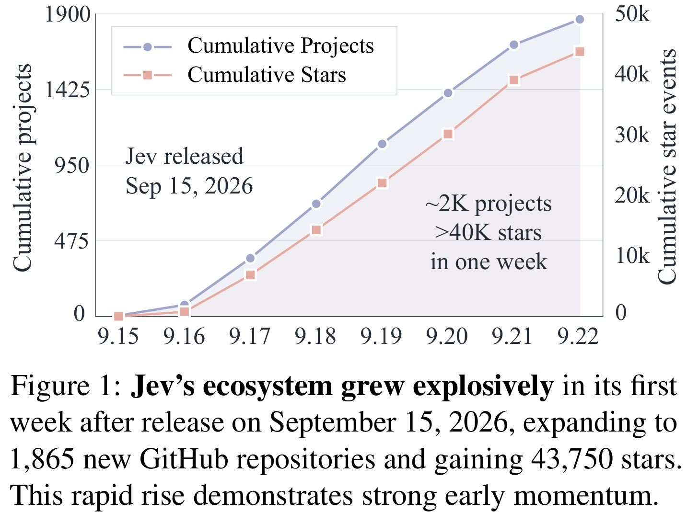
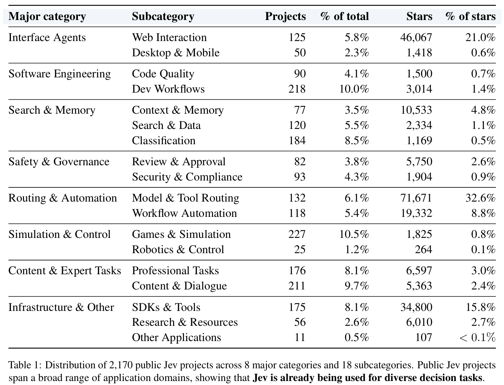
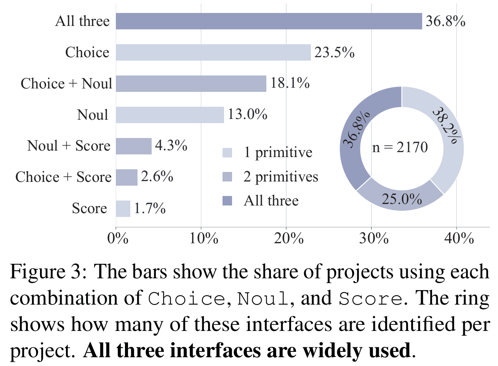
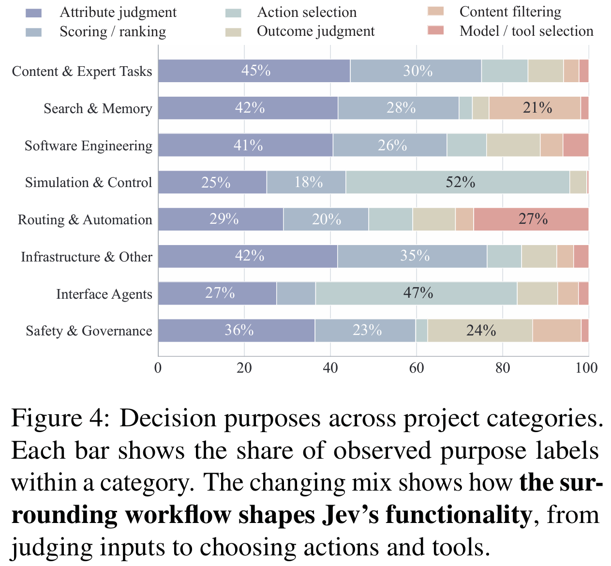
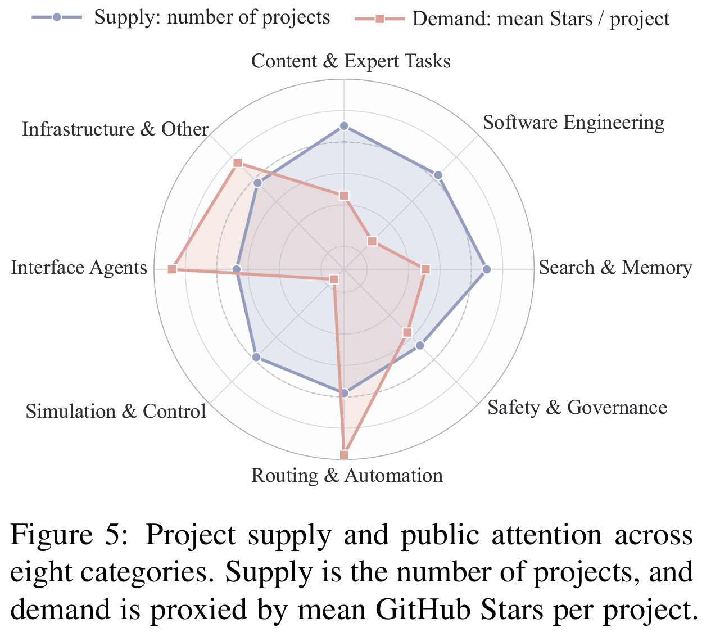

# Jev in the Wild: A Data-Driven Analysis of the Jev Model's Functionality, Applications and Ecosystem
> **Jev is a lightweight decision model for fast, structured decisions in AI systems and agents.**
> **What are people actually building with Jev?** We traced the model through **2,170 public GitHub projects** to see where it is used, what decisions it makes, and which parts of the ecosystem attract attention.

[**Paper**](https://arxiv.org/abs/2609.30216) · [**PDF**](https://arxiv.org/pdf/2609.30216) · [**Project**](https://github.com/linggm3/jev-in-the-wild) · [**BibTeX**](#citation)  
arXiv:2609.30216 · Public GitHub snapshot: **September 22, 2026**

| **2,170** | **8** | **61.8%** | **19.6% → 63.0%** |
| :---: | :---: | :---: | :---: |
| Verified Jev projects | Application categories | Use at least two interfaces | Projects → Stars in routing and interface agents |

## The idea in one minute

Jev is a **System One decision model** for frequent, small decisions. Instead of writing a long response, it can **choose an option** with *Choice*, **make a yes/no judgment** with *Noul*, or **assign a score** with *Score*. A browser agent might ask which action to take next; a search system might ask whether a document is relevant; a router might ask which model or tool should handle a request.

Those decisions only become useful when a larger program supplies context and acts on the answer. The paper therefore studies Jev **inside real applications**, rather than treating each model call as an isolated example. We retrieved candidate repositories from GitHub and included projects only when their public code or documentation showed a concrete use of Jev.

## Five findings from the paper

### 1. Jev grew through new projects and existing software

Jev was released on September 15, 2026. Over the following week, the study found **1,865 newly created repositories** and **305 older repositories** that had integrated Jev. The first group shows people starting fresh experiments; the second shows Jev becoming one step in software that already existed. The new repositories gained **43,750 GitHub Stars** during that week.



### 2. The applications span eight areas, not one dominant use case

The **2,170 verified projects** fall into **eight major categories and 18 subcategories**: interface agents, software engineering, search and memory, safety and governance, routing and automation, simulation and control, content and expert tasks, and infrastructure and other uses. The two largest categories, **Content and Expert Tasks (387 projects)** and **Search and Memory (381)**, each account for less than one fifth of the sample.

The category names describe actual jobs. A browser agent can use Jev to pick its next interaction; a code-review tool can screen a pull request for concerns; a game or robotics project can use it to choose an action from a constrained set. The full distribution is in the table below.



### 3. Developers often combine Jev's three interfaces

*Choice* answers “which one?”, *Noul* answers “is this true?”, and *Score* answers “how much?”. **61.8%** of the projects use at least two of them, and **36.8%** use all three. The three-interface combination is the single most common exact combination in the sample.

The paper's code-review example makes this concrete: Noul screens a change for possible risks, Choice selects a supporting diff hunk and failure category, and Score estimates priority or severity. One workflow can need judgment, selection, and scoring together. Separately, among projects with an identified decision purpose, **69.7%** use Jev for at least two purposes.



### 4. The workflow shapes what Jev does

The same model can serve different roles because each application asks a different question and uses the answer differently:

| In this setting | Jev can decide | The application then |
| --- | --- | --- |
| Browser or interface agent | Which action to take | Interacts with the page or interface |
| Search or memory system | Whether content is relevant | Keeps, filters, or retrieves it |
| Model router | Which model or tool to call | Dispatches the request |
| Game or simulation | Which move to make | Advances the environment |

Figure 4 shows the changing mix of decision purposes across categories. For example, **action selection is 52% of the observed purpose labels in Simulation and Control** and **47% in Interface Agents**; **model and tool selection is 27% in Routing and Automation**. These are shares of *purpose labels within each category*, not shares of projects.



### 5. GitHub attention is much more concentrated than project activity

**Routing and Automation** plus **Interface Agents** represent only **19.6% of projects**, yet their repositories receive **63.0% of the Stars** in this snapshot. Two similarly sized categories make the difference easy to see: Routing and Automation has **250 projects** averaging **364 Stars per project**; Simulation and Control has **252 projects** averaging **8**.

Figure 5 compares project count with mean Stars per project across all eight categories. Its two measures are normalized separately and shown on a logarithmic radial scale, so read it as a **relative comparison**, not raw project counts on the spokes. GitHub Stars measure attention to whole repositories; they cannot establish how often Jev is used, how well it works, or how much real-world demand a category has.



## What this suggests

- **Evaluate the whole decision workflow.** The surrounding application supplies the state, defines the available answers, and acts on Jev's output. That context determines the model's practical role.
- **Support more than one answer shape.** Selection, binary judgment, and scoring often appear together, so a general-purpose decision model should support their combinations.
- **Look beyond the most starred projects.** Public attention clusters around routing and interface agents, while many applications appear in less visible categories. A representative evaluation should cover both.

## Paper and project

The [full paper](https://arxiv.org/abs/2609.30216) explains the collection and verification process, the taxonomy, and the analyses behind these figures. **Appendix B examines seven applications** in detail, including browser interaction, code-review triage, tool-history compaction, tool-call risk checks, model routing, game control, and tax-document classification.


| Resource | Link |
| --- | --- |
| Paper | [arXiv:2609.30216](https://arxiv.org/abs/2609.30216) |
| PDF | [Read the full paper](https://arxiv.org/pdf/2609.30216) |
| Project | [GitHub repository](https://github.com/linggm3/jev-in-the-wild) |

**Scope:** This is a snapshot of verified **public GitHub projects as of September 22, 2026**. It does not cover private repositories or commercial applications. This project page provides the paper overview and citation; the analyzed dataset and code are not released here.

## Citation

Please use the paper's [arXiv-exported BibTeX](CITATION.bib):

```bibtex
@misc{ling2026jevwilddatadrivenanalysis,
      title={Jev in the Wild: A Data-Driven Analysis of the Jev Model's Functionality, Applications and Ecosystem}, 
      author={Guoming Ling and Muen Xue and Zijian Ye},
      year={2026},
      eprint={2609.30216},
      archivePrefix={arXiv},
      primaryClass={cs.SE},
      url={https://arxiv.org/abs/2609.30216}, 
}
```

**Keywords:** Jev model applications ecosystem · Jev in the Wild · arXiv 2609.30216 · 2,170 Jev projects · data-driven analysis · ecosystem survey / 应用生态综述 · System One model · decision model · model routing · AI agents
